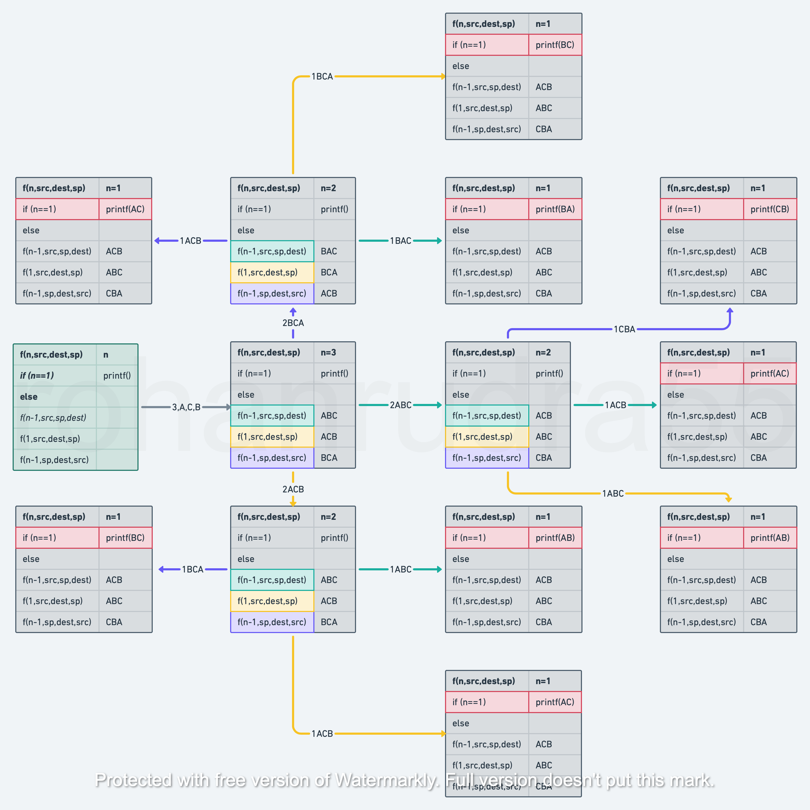

# DSA

## 📄Data Structures

---

1. Lists
2. Stacks
3. Queues
4. Trees
5. Hash
6. Maps
7. Graphs

## 📉Sorting Algorithms

---

- Bubble  Sort
- Insertion Sort
- Selection Sort
- Merge Sort
- Quick Sort
- Radix Sort
- Shell Sort
- Tree Sort
- Heap Sort

## 🔎Searching Algorithms

---

- Linear Search
- Binary Search
- Interpolation Search
- Jump Search
- Fibonacci Search

---

<aside>
💡 Tower of Hanoi (Using recursion under stacks)

</aside>

## 📜References

---

📒 Data Structures Using C by Reema Thareja 

- *Buy*
- *Download*